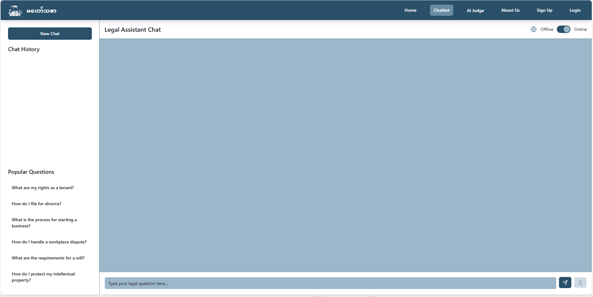
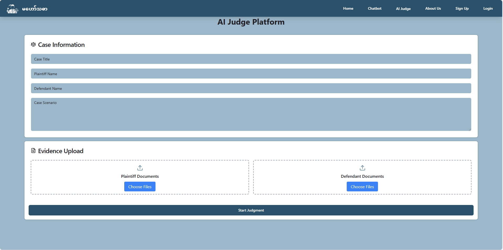

# Mahawthader
AI-Judge is an AI-powered legal system that assists users in understanding and resolving legal cases. It features a bilingual legal chatbot for general inquiries and an AI judge module that accepts case scenarios, analyzes documents from both sides, processes arguments over multiple rounds, and delivers a reasoned verdict.
=======
# Mahawthada Legal AI System

Mahawthada is an AI-powered legal assistant platform designed to analyze legal cases, generate verdicts, and provide legal insights using advanced language models and knowledge bases. The system features a Python backend for AI and data processing, and a modern frontend built with Vite, React, and Tailwind CSS.

## Features

- **AI Judge**: Automated legal case analysis and verdict generation
- **Chatbot**: Interactive legal assistant for Q&A and guidance
- **Knowledge Base**: Embedded legal knowledge for accurate responses
- **Case History**: Stores and manages verdicts and case files
- **Frontend Integration**: Modern UI for user interaction


## Screenshots





## Project Structure

```
Mahawthada/
  backend/           # Python backend (AI, database, logic)
    AI_Judge/        # Core AI modules and data
    chatbot.py       # Chatbot service
    mahawthada.db    # SQLite database
    ...
  src/               # Frontend source (React, TypeScript)
    components/      # React components
    pages/           # App pages
    ...
  public/            # Static assets
  index.html         # Main HTML file
  package.json       # Frontend dependencies
  ...
```

## Backend (Python)

- **Location**: `Mahawthada/backend/`
- **Main Modules**:
  - `chatbot.py`: Chatbot logic and API
  - `AI_Judge/`: Legal analysis, verdict builder, and LLM handler
  - `mahawthada.db`: SQLite database for storing case data
- **Setup**:
  1. Create a Python virtual environment:
     ```powershell
     python -m venv venv
     .\venv\Scripts\activate
     ```
  2. Install dependencies:
     ```powershell
     pip install -r requirements.txt
     ```
  3. Run the backend server (update with actual entry point if needed):
     ```powershell
     python chatbot.py
     ```

## Frontend (React + Vite)

- **Location**: `Mahawthada/src/`
- **Setup**:
  1. Install Node.js (v16+ recommended)
  2. Install dependencies:
     ```powershell
     npm install
     ```
  3. Start the development server:
     ```powershell
     npm run dev
     ```
  4. Access the app at `http://localhost:5173` (default Vite port)

## Configuration

- **Tailwind CSS**: Configured via `tailwind.config.ts`
- **Vite**: Configured via `vite.config.ts`
- **TypeScript**: Project-wide type safety
- **Database**: SQLite (`mahawthada.db`)

## Usage

1. Start the backend server (Python)
2. Start the frontend server (Node.js/Vite)
3. Interact with the AI legal assistant via the web interface
4. Review generated verdicts and case history in the backend

## File Descriptions

- `backend/AI_Judge/`: Core AI and legal logic
- `backend/chatbot.py`: Main chatbot and API logic
- `backend/mahawthada.db`: Database file
- `src/`: Frontend source code
- `public/`: Static assets

## Development

- **Linting**: ESLint configured for TypeScript/React
- **Styling**: Tailwind CSS utility classes
- **Testing**: (Add details if test framework is present)

## Contributing

1. Fork the repository
2. Create a new branch (`git checkout -b feature/your-feature`)
3. Commit your changes
4. Push to your fork and submit a pull request


## Acknowledgements

- OpenAI, LangChain, and other open-source libraries
- Legal professionals for domain expertise

---

For more details, see the `FRONTEND_INTEGRATION_GUIDE.md` in the backend folder.

You can also install [eslint-plugin-react-x](https://github.com/Rel1cx/eslint-react/tree/main/packages/plugins/eslint-plugin-react-x) and [eslint-plugin-react-dom](https://github.com/Rel1cx/eslint-react/tree/main/packages/plugins/eslint-plugin-react-dom) for React-specific lint rules:

```js
// eslint.config.js
import reactX from 'eslint-plugin-react-x'
import reactDom from 'eslint-plugin-react-dom'

export default tseslint.config([
  globalIgnores(['dist']),
  {
    files: ['**/*.{ts,tsx}'],
    extends: [
      // Other configs...
      // Enable lint rules for React
      reactX.configs['recommended-typescript'],
      // Enable lint rules for React DOM
      reactDom.configs.recommended,
    ],
    languageOptions: {
      parserOptions: {
        project: ['./tsconfig.node.json', './tsconfig.app.json'],
        tsconfigRootDir: import.meta.dirname,
      },
      // other options...
    },
  },
])
```
